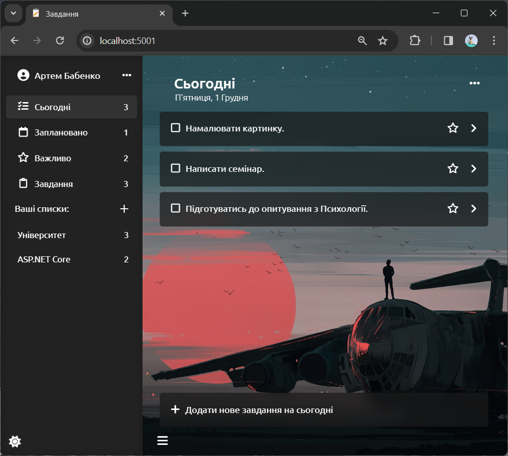
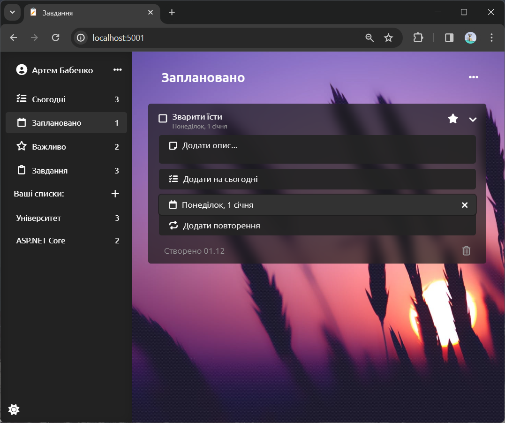
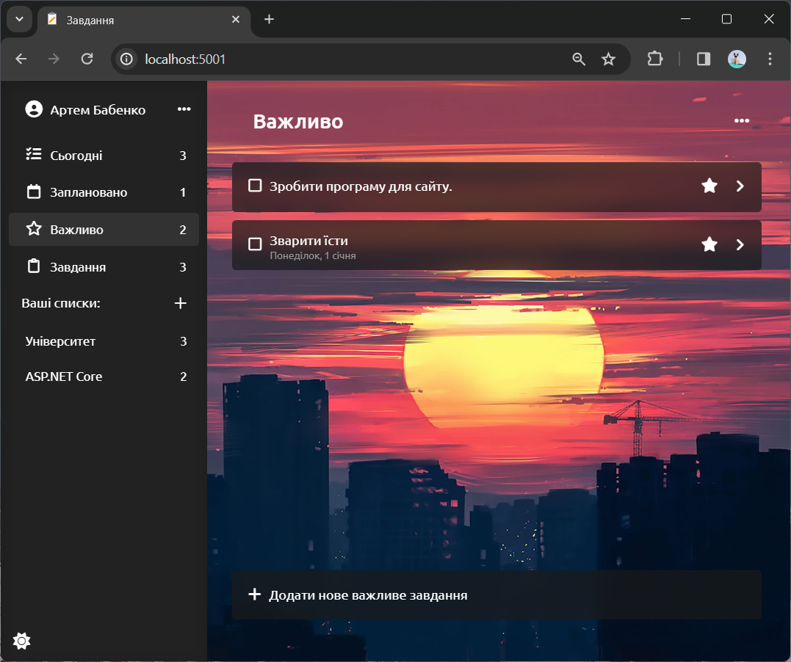
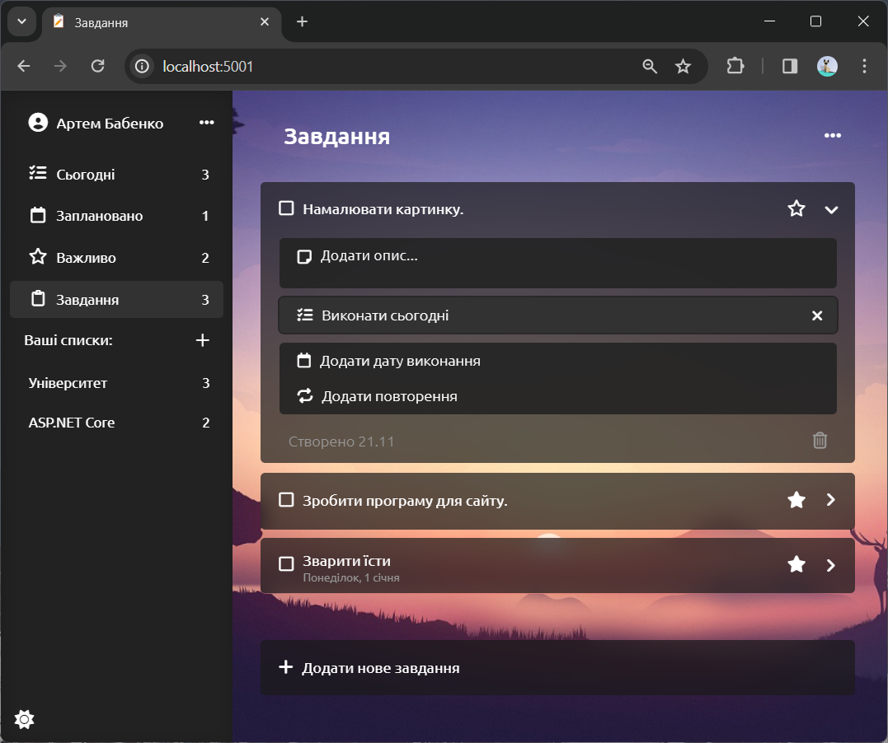
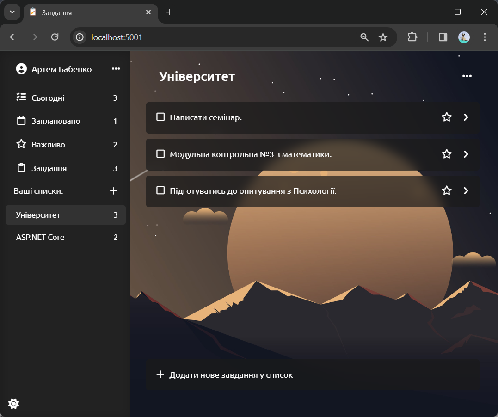
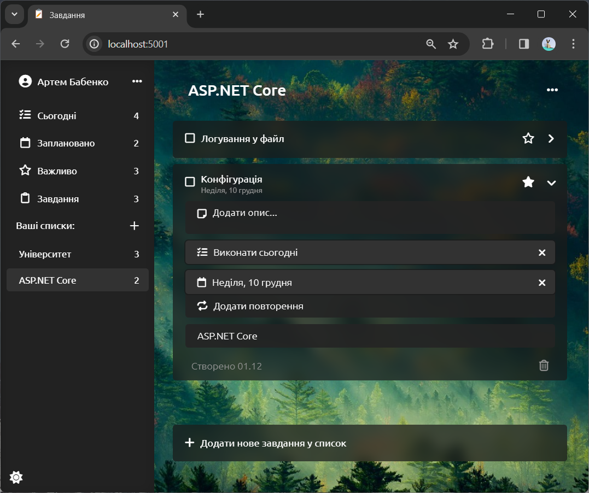
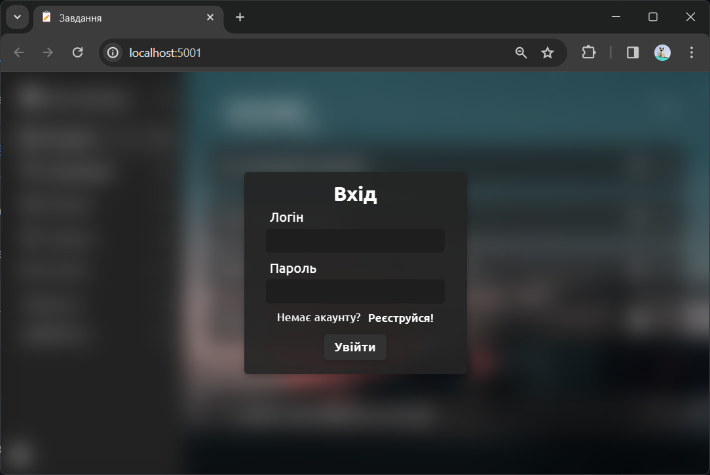
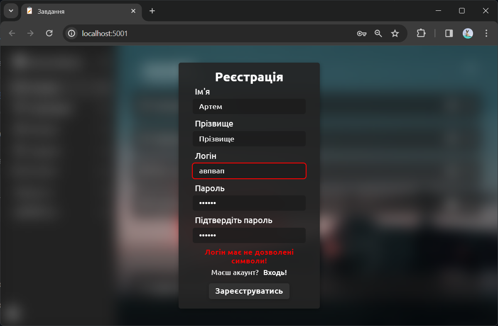
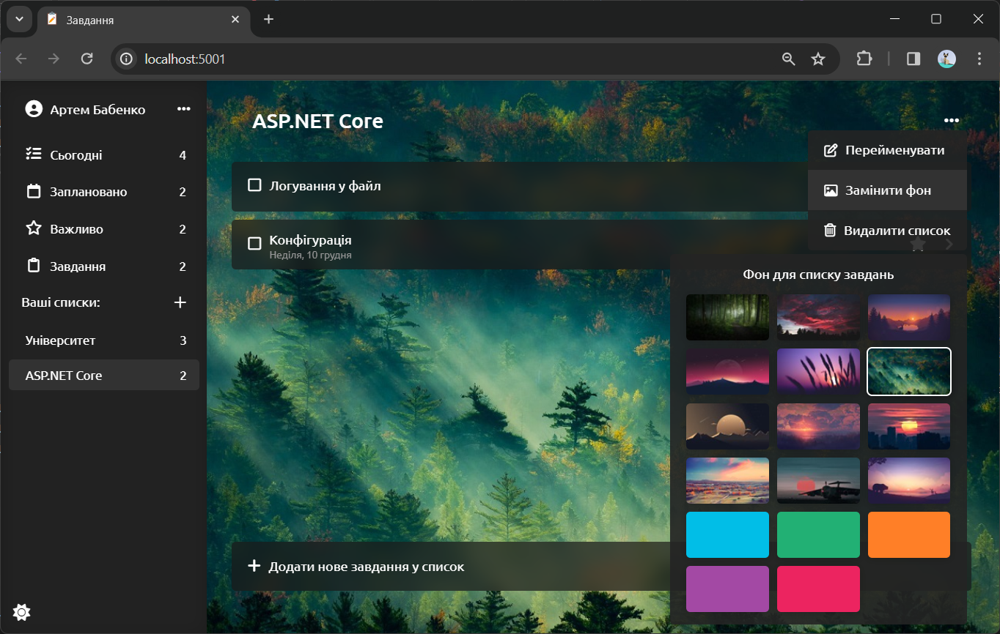
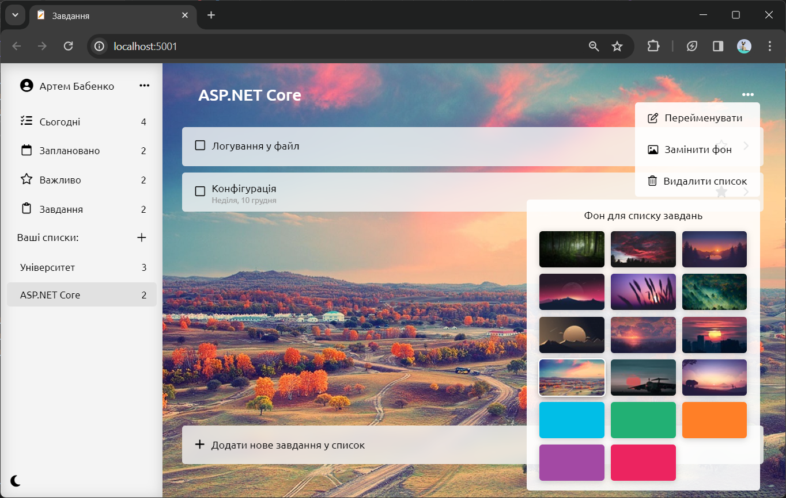

## Список завдань
Проект "Список завдань" – це веб-додаток для створення, управління та видалення **щоденних завдань**. Головна мета проекту полягає в створенні зручного та ефективного інструменту для кращого організації справ користувача. Сайт розроблений як односторінковий застосунок (Single Page Application – **SPA**), що забезпечує плавну взаємодію користувача **без перезавантаження сторінок**. Створений з використанням фреймворку **ASP.NET Core (REST API)** та написаний на мовах: C#, JavaScript, Html, Css. [Відео користування сайтом.](https://youtu.be/y8n83VHEKAM)

### Вкладка "Сьогодні"

На вкладці "Сьогодні" користувач швидко може переглядати завдання, заплановані на сьогодні. Кожне завдання, відмічене як **"виконати сьогодні"**, відображається тут, сприяючи зручному плануванню та пріоритизації. Користувач може легко встановлювати цю властивість для кожного завдання в будь-якому списку.

### Вкладка "Плановано"

Тут представлені завдання, які мають **конкретну дату виконання**. Користувач може легко встановлювати дату для кожного завдання, натискуючи відповідну клавішу та вибираючи дату у випадаючому **календарі**.

### Вкладка "Важливо"

Користувач може позначити будь-яке завдання як **важливе** за допомогою "зірочки". Завдання з цією властивістю буде відображатись на вкладці **"Важливо"**, щоб акцентувати увагу на особливо важливих пунктах.

### Вкладка "Завдання"

Усі завдання з усіх вкладок відображаються тут. Завдання, які вже **виконані, позначаються закресленим текстом та галочкою**, щоб легко відокремити завершені завдання від тих, які ще потребують уваги.

### Персональні списки для кожного користувача
  
  

У кожного користувача є можливість **створювати персональні списки** завдань та присвоювати їм будь-які назви. Якщо завдання відноситься до конкретного списку, то в описі завдання буде вказано, з якого саме списку воно походить.

### Реєстрація та вхід

Сайт обладнаний системою **авторизації** користувачів, яка включає в себе встановлені **правила для реєстрації**. Наприклад, пароль повинен складатися з не менше ніж 8 символів, а логін має обмеження на використання певних символів.

### Зміна фону списків та світла тема сайту.

Додатково на сайті доступна невелика можливість персоналізації. Користувачі можуть змінювати **фонове зображення** (вибираючи з декількох гарних картинок або просто вибираючи один із доступних кольорів) для кожного зі списків завдань. Крім того, доступні **біла та темна теми** для сайту, щоб користувачі могли обирати стиль, який найбільше відповідає їхнім вподобанням.

