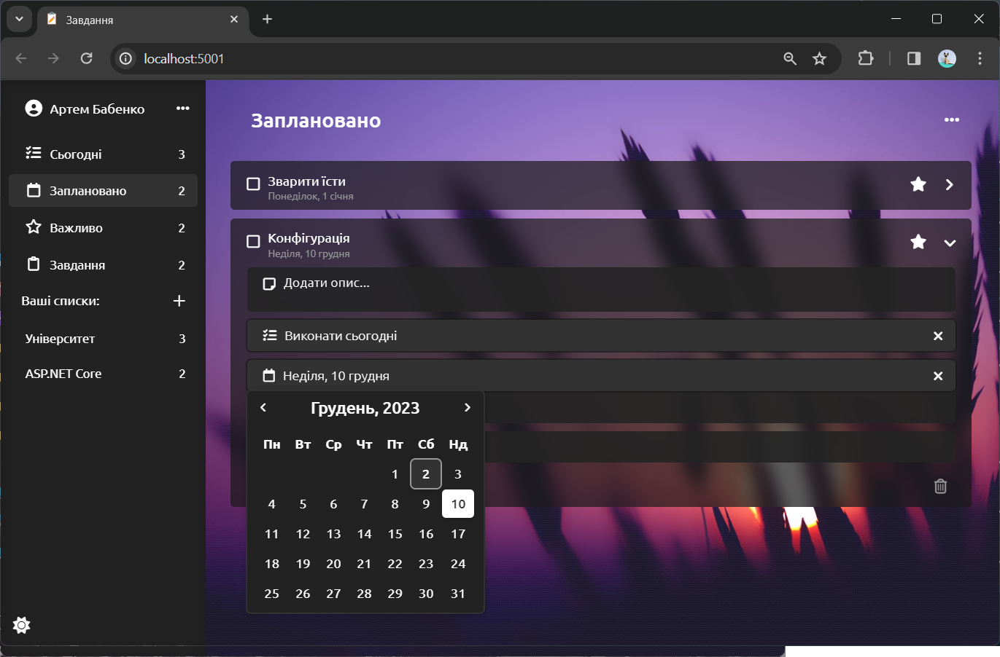

# Список завдань
### Проект "Список завдань" – це онлайн-інструмент для створення, управління та видалення щоденник завдань. Головна мета проекту полягає в створенні зручного та ефективного інструменту для кращого організації справ користувача.

# Вкладка "Сьогодні"

### На вкладці "Сьогодні" користувач швидко може переглядати завдання, заплановані на сьогодні. Кожне завдання, відмічене як "виконати сьогодні", відображається тут, сприяючи зручному плануванню та пріоритизації. Користувач може легко встановлювати цю властивість для кожного завдання в будь-якому списку.

# Вкладка "Плановано"

### Тут представлені завдання, які мають назначену конкретну дату виконання. Користувач може легко встановлювати дату для кожного завдання, натискуючи відповідну клавішу та вибираючи дату у випадаючому календарі. 

# Вкладка "Важливо"

### Користувач може позначити будь-яке завдання як важливе за допомогою "зірочки". Завдання з цією властивістю буде відображатись на вкладці "Важливо", щоб акцентувати увагу на особливо важливих пунктах.

# Вкладка "Завдання"

### Усі завдання з усіх вкладок відображаються тут. Завдання, які вже виконані, позначаються закресленим текстом та галочкою, щоб легко відокремити завершені завдання від тих, які ще потребують уваги.

